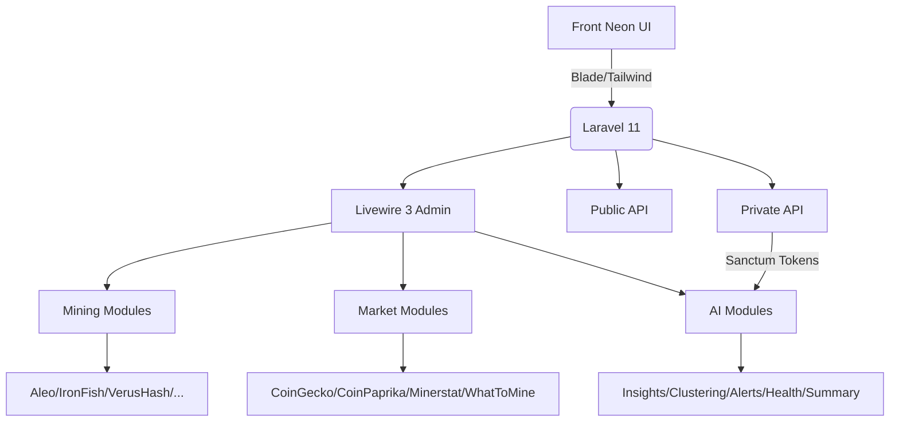
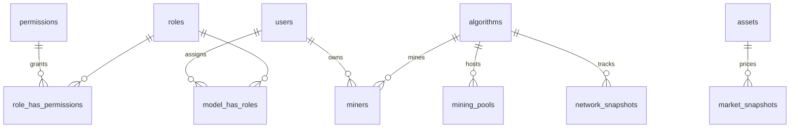

# BeCryptoCLUB – Code X Hub

## Arquitectura Modular

## Diagrama de Base de Datos

## Convenciones de módulos
- Cada módulo vive en `app/Modules/<Domain>/<Submodule>` con carpetas `Controllers`, `Livewire`, `Views`, `Policies`, `Services`, `Routes`.
- Las rutas públicas usan `routes/api.php` y las privadas utilizan middleware `auth:sanctum` + `throttle:private_api`.
- Se utilizará `spatie/laravel-permission` para roles/permisos y `Sanctum` para autenticación tokenizada.
